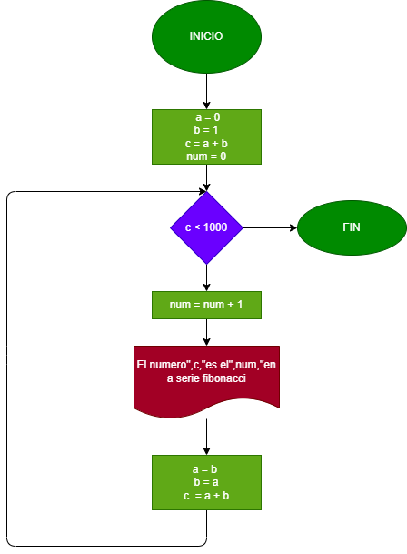

# EJERCICIO 3
## La serie Fibonachi es una secuencia numérica, en la cual cada elemento es igual a la suma de los dos anteriores. Tomando como variables iniciales los dos primeros elementos, a=0 y b=1, hacer el diagrama de flujo y el programa en pyhton, que calcule e imprima a partir del tercero, todos los elementos de la serie de Fobonachi que sean menores de 1000.

 
